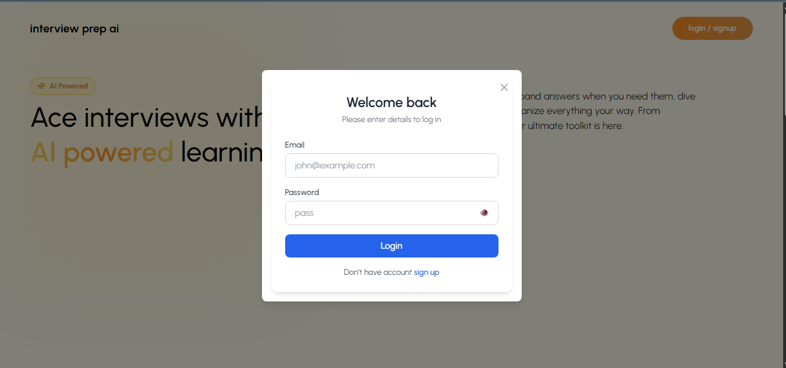
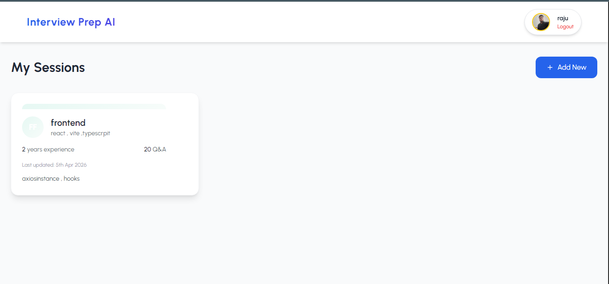
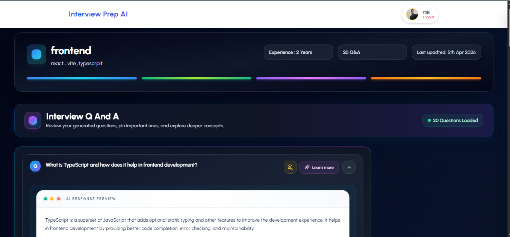

# 🚀 AI Interview Prep App

An **AI-powered Interview Preparation Platform** built with the **MERN Stack** that helps users generate role-based interview questions, view detailed answers, save interview sessions, and prepare smarter for technical interviews.

This project is designed to simulate a real-world interview preparation workflow using **React**, **Node.js**, **Express.js**, **MongoDB**, and **AI-generated content**.

---

## 📌 Features

- 🔐 **User Authentication**
  - Register/Login with secure JWT authentication
  - Protected routes for authorized users only

- 🤖 **AI-Powered Interview Question Generation**
  - Generate interview questions based on:
    - Job Role
    - Years of Experience
    - Topics to Focus On
    - Number of Questions
  - AI also provides **beginner-friendly detailed answers**

- 📝 **Interview Session Management**
  - Create new interview prep sessions
  - Save generated questions & answers
  - View all previous sessions
  - Open a single session by ID
  - Delete sessions

- 📚 **Learn More / Expand Answers**
  - View detailed explanations for answers
  - Supports structured response rendering

- 📌 **Pin Important Questions**
  - Mark key questions for quick revision

- 🎨 **Modern UI**
  - Clean responsive interface built with React + Tailwind CSS
  - Drawer / modal based UX for better interaction

- ⚡ **REST API Backend**
  - Organized controllers, routes, and middleware
  - Secure API architecture

---

## 🛠️ Tech Stack

### Frontend
- **React.js**
- **Tailwind CSS**
- **Axios**
- **React Icons**
- **React Router DOM**

### Backend
- **Node.js**
- **Express.js**
- **MongoDB**
- **Mongoose**
- **JWT Authentication**
- **bcryptjs**

### AI Integration
- AI-based question and answer generation (via prompt-driven API integration)

---

## 📂 Project Structure

```bash
ai-interview-prep/
│
├── frontend/
│   ├── src/
│   │   ├── components/
│   │   ├── pages/
│   │   ├── utils/
│   │   ├── context/
│   │   └── App.jsx
│   └── package.json
│
├── backend/
│   ├── controllers/
│   ├── routes/
│   ├── models/
│   ├── middlewares/
│   ├── config/
│   ├── utils/
│   ├── server.js
│   └── package.json
│
└── README.md
```

---

## 🔥 Core Functionalities

### 1. User Authentication
- Sign up with name, email, and password
- Login securely using JWT
- Token-based access to protected endpoints

### 2. Create Interview Session
Users can generate a new interview session by providing:
- **Role** (e.g., Frontend Developer, Python Developer, MERN Stack Developer)
- **Experience Level**
- **Topics to Focus On**
- **Number of Questions**

### 3. AI Response Generation
The app generates:
- Role-specific interview questions
- Detailed beginner-friendly answers
- Optional code examples (if required)

### 4. Session Storage
Generated sessions are stored in MongoDB so users can:
- Revisit old sessions
- Continue practicing later
- Track preparation history

### 5. Session Deletion
Users can remove unwanted interview sessions from the dashboard.

---

## 📸 Screenshots

> Add your project screenshots here for a stronger GitHub portfolio.

Example:
- Login Page
- Dashboard
- Create Session Form
- Generated AI Questions
- Session Details Page







---

## ⚙️ Installation & Setup

## 1️⃣ Clone the Repository

```bash
git clone [https://github.com/Tushar-6969/AI_INTERVIEW_PREPARATION/](https://github.com/Tushar-6969/AI_INTERVIEW_PREPARATION/.git)
cd ai-interview-prep
```

---

## 2️⃣ Backend Setup

```bash
cd backend
npm install
```

Create a `.env` file inside the `backend` folder:

```env
PORT=8000
MONGO_URI=your_mongodb_connection_string
JWT_SECRET=your_jwt_secret
AI_API_KEY=your_ai_api_key
```

Start backend server:

```bash
npm run dev
```

---

## 3️⃣ Frontend Setup

Open a new terminal:

```bash
cd frontend
npm install
npm run dev
```

---

## 🌐 Environment Variables

### Backend `.env`

```env
PORT=8000
MONGO_URI=your_mongodb_connection_string
JWT_SECRET=your_super_secret_key
AI_API_KEY=your_ai_api_key
```

> Replace these values with your actual credentials.

---

## 📡 API Endpoints

### Auth Routes

| Method | Endpoint             | Description         |
|--------|----------------------|---------------------|
| POST   | `/api/auth/register` | Register new user   |
| POST   | `/api/auth/login`    | Login user          |
| GET    | `/api/auth/profile`  | Get user profile    |

### Session Routes

| Method | Endpoint                      | Description                |
|--------|-------------------------------|----------------------------|
| POST   | `/api/sessions/create`        | Create interview session   |
| GET    | `/api/sessions/my-sessions`   | Get all user sessions      |
| GET    | `/api/sessions/:id`           | Get session by ID          |
| DELETE | `/api/sessions/:id`           | Delete session by ID       |

---

## 🧠 Example Use Case

### Input:
- **Role:** MERN Stack Developer
- **Experience:** 1 Year
- **Topics:** React, Node.js, MongoDB, JWT
- **Questions:** 10

### Output:
- AI generates 10 interview questions
- Each question includes:
  - Detailed explanation
  - Beginner-friendly answer
  - Optional code snippet (if relevant)

---

## 🚀 Future Improvements

- ✅ Add **mock interview mode**
- ✅ Add **voice-based Q&A practice**
- ✅ Add **difficulty levels** (Beginner / Intermediate / Advanced)
- ✅ Add **resume-based interview question generation**
- ✅ Add **export to PDF**
- ✅ Add **bookmark/favorite sessions**
- ✅ Add **analytics dashboard** for progress tracking
- ✅ Add **coding challenge mode**

---

## 💡 Why This Project Stands Out

This is not just a CRUD MERN project.

It demonstrates:
- Full-stack MERN development
- Authentication & protected routes
- Real-world API integration
- AI prompt engineering
- Dynamic data rendering
- Clean UI/UX
- Scalable project structure

This makes it a **strong resume project** for:
- Software Engineer roles
- Full Stack Developer roles
- MERN Stack Developer roles
- Entry-level AI-integrated web app portfolios

---

## 🧪 Challenges Solved During Development

- Handling structured AI responses properly
- Rendering generated answers cleanly in the frontend
- Managing protected routes with JWT
- Saving nested question-answer session data in MongoDB
- Implementing delete functionality for saved sessions
- Handling loading states, timeouts, and API errors

---

## 📌 Learning Outcomes

Through this project, I learned:
- Building a complete MERN stack application
- Creating secure authentication flows
- Designing REST APIs with Express.js
- Managing MongoDB schemas using Mongoose
- Integrating AI-generated content into a web app
- Structuring frontend components for scalability
- Handling asynchronous API requests with Axios

---

## 👨‍💻 Author

**Tushar Rathor**  
- LinkedIn: [https://www.linkedin.com/in/tushar-rathor-277427259/](https://www.linkedin.com/in/tushar-rathor-277427259/)  
- GitHub: [https://github.com/Tushar-6969](https://github.com/Tushar-6969)

---

## 📄 License

This project is licensed under the **MIT License**.  
Feel free to use, modify, and improve it.

---

## ⭐ Support

If you found this project useful:

- Star this repository ⭐
- Fork it 🍴
- Share feedback 💬

---

## 🙌 Acknowledgements

Inspired by MERN stack learning projects and AI-powered developer tools.  
Built as a practical project to improve interview preparation and full-stack development skills.
